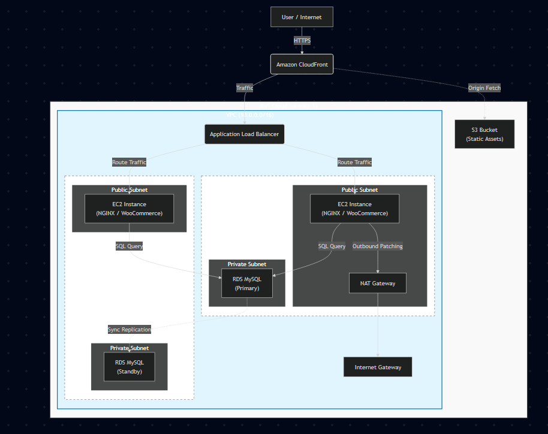

# AWS Cloud Migration & Security Hardening
**Project Context:** This project simulates a real-world cloud migration for a fictional e-commerce company. While the business scenario is hypothetical, the infrastructure, security controls, and performance tests were **fully deployed and validated in a live AWS environment**.

## Executive Summary
FillerName, a fast-growing e-commerce company, successfully migrated its public-facing website and internal customer database from a legacy, self-hosted environment to Amazon Web Services (AWS). The project was executed by the internal server administrator over an 8-day timeline using the Waterfall methodology to ensure strict documentation and minimize scope creep. The primary goal was to resolve critical deficits in scalability, security, and operational inefficiency caused by aging on-premises hardware.

| Challenge | Legacy Environment Issues | Cloud Solution Implementation |
| :--- | :--- | :--- |
| Availability | **Single Point of Failure:** The web app and database shared one physical server. A power outage or hardware failure would take the entire platform offline. | High Availability: Implemented a Multi-Availability Zone (AZ) architecture. If one data center fails, traffic automatically reroutes to another, ensuring continuity. |
| Scalability | **Fixed Capacity:** The physical server could not scale to meet peak traffic. The Apache web server process created strain during high demand. | **Auto-Scaling:** Migrated to NGINX and implemented Auto Scaling Groups (ASG) to dynamically add or remove instances based on traffic, ensuring performance during surges. |
| Security | **Flat Architecture:** Lacked separation between the public internet and the internal network, leaving the database vulnerable to lateral movement attacks. | **Defense-in-Depth:** Created a multi-tiered Virtual Private Cloud (VPC) with strict network segmentation. The database is isolated in a private subnet with no direct internet access. |
| Cost & Ops | **CapEx Model:** Required expensive, sporadic hardware replacements. IT staff spent excessive time on manual patching and maintenance. | **OpEx Model:** Shifted to a pay-as-you-go model. Managed services (AWS RDS) automated patching, reducing maintenance labor from ~10 hours to ~1 hour per month. |

---

## Architecture & Design
The new environment utilizes a **Virtual Private Cloud (VPC)** with a multi-tier subnet strategy to isolate sensitive data.

### Key Components
* **Compute:** EC2 instances running NGINX for the web application.
* **Database:** AWS RDS (MySQL) deployed in private subnets for isolation.
* **Scaling:** Auto Scaling Groups (ASG) and Application Load Balancers (ALB) to handle traffic spikes.
* **Content Delivery:** Amazon CloudFront and S3 for caching static assets.

---

## Security Controls Implemented
To mitigate lateral movement and unauthorized access, I implemented a Defense-in-Depth strategy.

| Control | Implementation Details |
| :--- | :--- |
| **Network Segmentation** | Database resides in a private subnet with no direct internet access. |
| **Security Groups** | The database SG only accepts traffic from the Web Server SG on port 3306. |
| **Access Control** | SSH access is restricted strictly to the Admin VPN IP address. |

---

## Validation & Success Metrics
The new architecture was stress-tested against four key performance indicators (KPIs).

### 1. System Uptime (Availability)
* **Target:** 99.95% uptime.
* **Result:** **100% uptime** achieved during the 7-day test period with zero downtime recorded.

### 2. Auto-Scaling Efficiency
* **Scenario:** Simulated traffic spike causing CPU >60%.
* **Result:** New instances were provisioned and "InService" within **2 minutes and 45 seconds**, well under the 5-minute SLA.

### 3. Latency & Performance
* **Target:** Response time <500ms for 95% of requests.
* **Result:** 95% of requests were served within **320 milliseconds**.

### 4. Security Validation
* **Test:** Attempted 10 direct connections to the database from the public internet.
* **Result:** **100% of attempts failed** (Connection Timed Out), confirming the firewall rules were active.

---

## Cost-Benefit Analysis
The migration has aligned FillerName’s infrastructure with its cultural pillars of frugality and employee well-being. By moving to an Operational Expense (OpEx) model, the company eliminated the risk of sudden $5,000 hardware replacement costs and optimized spending through auto-scaling. Furthermore, the IT team has shifted focus from reactive "fire-fighting" and manual maintenance to strategic business initiatives, as the cloud environment now automates critical patching and redundancy tasks.
